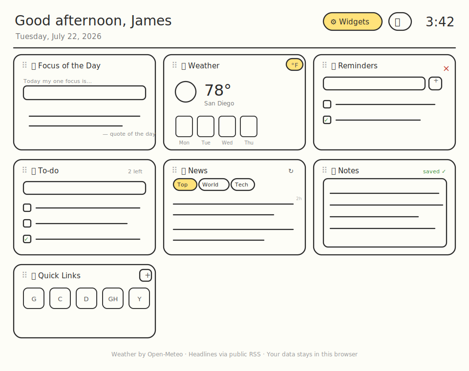
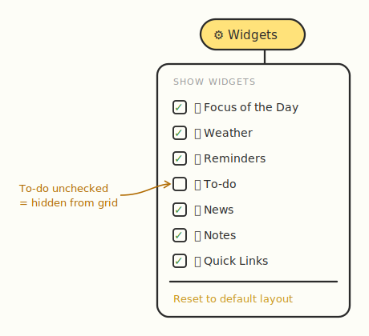
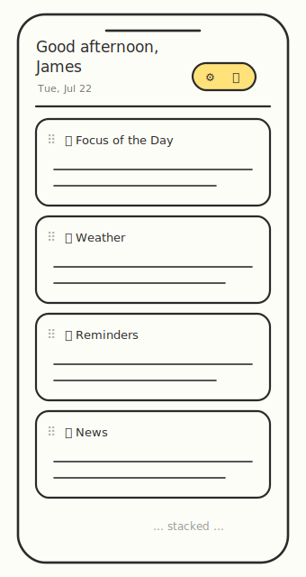
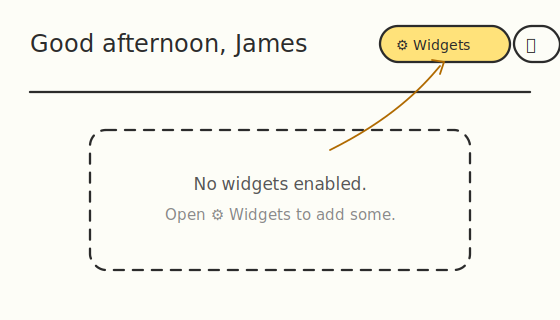

# Wireframes

Hand-drawn, low-fidelity sketches of the dashboard. These describe structure and
behaviour, not exact pixels. Colours follow the two themes (black & yellow
default, purple/blue as the dark variant); the yellow highlights in the sketches
mark the accent colour.

> The sketches are SVGs in [`docs/wireframes/`](./wireframes/); an ASCII appendix
> follows at the bottom for quick diffs and screen-reader access.

## 1. Desktop — full dashboard



Responsive card grid (columns auto-fill, min ~300px, and reflow). Each card has a
drag handle (⠿) for reordering and a remove (×) control on hover.

## 2. Widget menu (⚙️ Widgets open)



Opened from the header; closes on outside-click or Escape. Unchecking a widget
hides it from the grid; "Reset to default layout" restores the full set and order.

## 3. Mobile / narrow (single column)



Below ~300px per column the grid collapses to a single stacked column.

## 4. Empty state (all widgets removed)



## 5. Interaction notes

- **Reorder:** grab a card's ⠿ handle and drag; cards animate smoothly out of the
  way and the dragged card drops into place. The order persists (localStorage
  `layout`).
- **Remove:** hover a card → its `×` appears (top-right) → click to hide. Re-add
  it any time from the widget menu.
- **Theme:** the toggle flips black/yellow ↔ purple/blue and persists; the initial
  theme follows the OS setting.
- **Editable name:** click the name in the greeting to edit inline.
- **All network widgets** (weather, news) show explicit loading, error, and retry
  states — a failed request never blanks the card.
- **Footer:** small print with links to the Privacy Policy and Terms of Service.

---

## Appendix — ASCII reference

<details>
<summary>Plain-text layouts (for diffs / screen readers)</summary>

### Desktop

```
┌──────────────────────────────────────────────────────────────────────────┐
│  Good afternoon, James                        [⚙️ Widgets] [🌙]   3:42:07  │
│  Tuesday, July 22, 2026                                                    │
├──────────────────────────────────────────────────────────────────────────┤
│  ┌────────────────┐  ┌────────────────┐  ┌────────────────┐                │
│  │⠿ 🎯 Focus      │  │⠿ 🌦️ Weather °F │  │⠿ ⏰ Reminders ×│                │
│  └────────────────┘  └────────────────┘  └────────────────┘                │
│  ┌────────────────┐  ┌────────────────┐  ┌────────────────┐                │
│  │⠿ ✅ To-do      │  │⠿ 📰 News     ↻ │  │⠿ 📝 Notes      │                │
│  └────────────────┘  └────────────────┘  └────────────────┘                │
│  ┌────────────────┐                                                        │
│  │⠿ 🔗 Quick Links│   Cards drag to reorder; grid reflows to fill space.   │
│  └────────────────┘                                                        │
│  Privacy · Terms · Weather by Open-Meteo · Data stays in your browser      │
└──────────────────────────────────────────────────────────────────────────┘
```

### Widget menu

```
                    [⚙️ Widgets]┌──────────────────────────┐
                                │ SHOW WIDGETS             │
                                │ ☑ 🎯 Focus of the Day    │
                                │ ☐ ✅ To-do  (hidden)     │
                                │ ☑ …                      │
                                │ Reset to default layout  │
                                └──────────────────────────┘
```

### Empty state

```
No widgets enabled. Open ⚙️ Widgets to add some.
```

</details>
